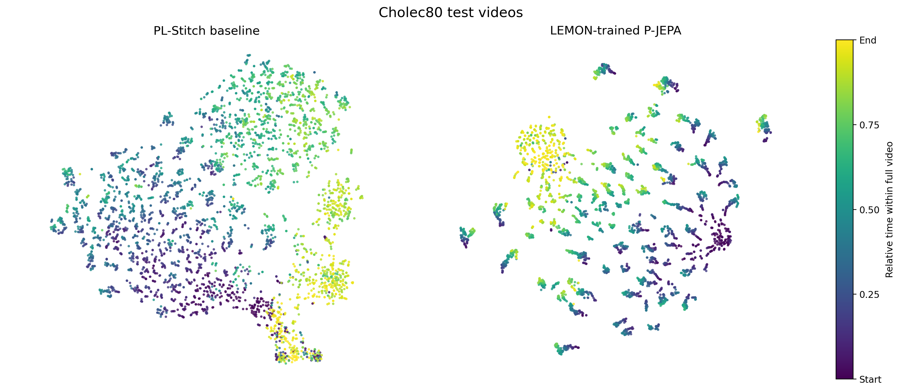

# P-JEPA

[Models](https://huggingface.co/FelTris/pjepa) ·
[Datasets](https://huggingface.co/datasets/FelTris/pjepa_features) ·
[Training and evaluation](docs/experiments.md)

PyTorch code and pretrained models for self-supervised temporal representation
learning on video feature sequences. This repository includes training,
evaluation, and inference for LEMON, Cholec80, M2CAI16, Assembly101, and EgoProceL.

P-JEPA takes precomputed features as input and learns representations over time.
The release includes five encoders, five linear probe heads, feature archives,
and scripts for building archives from existing features.



**Frozen transfer / zero-shot encoder application to Cholec80.**
The LEMON-trained P-JEPA encoder is applied without fine-tuning on Cholec80.
The t-SNE panels compare PL-Stitch features (left) with frozen P-JEPA
representations (right): 100 frames sampled uniformly from each of the 40
held-out videos, colored by relative time from start (purple) to end (yellow).
Cholec80 development labels were used for checkpoint selection; supervised
linear probes are separate from this representation visualization.

**Use block-causal models for new work.** Clip-causal models assume ground-truth
segment boundaries are available. They are retained as oracle comparisons;
those boundaries are generally unavailable in real-world inference. Block-causal
attention uses fixed temporal blocks, with bidirectional attention within each
block. See [protocols](docs/protocols.md) for the complete experimental assumptions.

## Installation

Requires Python 3.11+ and PyTorch 2.6+. Install the PyTorch build appropriate for
your hardware, then:

```bash
git clone https://github.com/FelTris/pjepa.git
cd pjepa
python -m pip install -e . huggingface_hub
```

Optional dependencies: `pip install -e '.[temporal]'` for LTContext/LT-Causal,
`'.[builders]'` for feature archive builders, or `'.[dev]'` for development.
Run the examples below from the repository root.

## Models

Encoder weights are hosted on [Hugging Face](https://huggingface.co/FelTris/pjepa)
(2.50 GB total). The input features and sampling rate must match the checkpoint.

| Checkpoint | Input features | Input → output width | Attention |
|---|---|---|---|
| [lemon_plstitch_block32.pt](https://huggingface.co/FelTris/pjepa/resolve/main/lemon_plstitch_block32.pt) | PL-Stitch, 1 fps | 768 → 768 | 32-token blocks |
| [assembly101_tsm_block64.pt](https://huggingface.co/FelTris/pjepa/resolve/main/assembly101_tsm_block64.pt) | TSM, 3.75 fps | 2048 → 1408 | 64-token blocks |
| [assembly101_tsm_clip.pt](https://huggingface.co/FelTris/pjepa/resolve/main/assembly101_tsm_clip.pt) | TSM, 3.75 fps | 2048 → 1408 | Clip-causal (oracle) |
| [egoprocel_fact_features_clip.pt](https://huggingface.co/FelTris/pjepa/resolve/main/egoprocel_fact_features_clip.pt) | FACT I3D features, 4 fps | 2048 → 1408 | Clip-causal (oracle) |
| [egoprocel_pooled_clip.pt](https://huggingface.co/FelTris/pjepa/resolve/main/egoprocel_pooled_clip.pt) | Pooled V-JEPA, 4 fps | 1408 → 1408 | Clip-causal (oracle) |

Download all five encoders alongside the included linear heads:

```bash
hf download FelTris/pjepa --include '*.pt' --local-dir checkpoints/weights
```

The following linear heads are included in this Git repository (1.25 MB total):

| Checkpoint in `checkpoints/weights/` | Input |
|---|---|
| `cholec80_raw_linear.pt` | Raw PL-Stitch |
| `cholec80_student_linear.pt` | `lemon_plstitch_block32` |
| `m2cai16_raw_linear.pt` | Raw PL-Stitch |
| `m2cai16_student_linear.pt` | `lemon_plstitch_block32` |
| `assembly101_oracle_clip_ltcausal_linear.pt` | `assembly101_tsm_clip` |

No pretrained temporal heads or EgoProceL heads are bundled. Fit a head for
Assembly101 block-causal evaluation. The [checkpoint manifest](checkpoints/manifest.json)
records architectures, SHA-256 checksums, and head/config associations.

## Datasets

Download precomputed features and their matching annotations from
[FelTris/pjepa_features](https://huggingface.co/datasets/FelTris/pjepa_features).
No video decoding or feature-extractor installation is needed.

| Feature archive | Stored fps | Videos | Size |
|---|---:|---:|---:|
| LEMON / PL-Stitch | 4 (sampled at 1 for P-JEPA) | 4,194 | 40.24 GB |
| Cholec80 / PL-Stitch | 1 | 80 | 0.57 GB |
| M2CAI16 / PL-Stitch | 1 | 41 | 0.29 GB |
| Assembly101 / TSM | 3.75 | 265 | 3.37 GB |
| EgoProceL / FACT I3D features | 4 | 423 | 8.33 GB |
| EgoProceL / pooled V-JEPA | 4 | 423 | 5.73 GB |

Download all archives and segment manifests (58.56 GB including annotations):

```bash
hf download FelTris/pjepa_features --repo-type dataset --local-dir data
```

For a smaller download, select only the dataset you need. For example:

```bash
hf download FelTris/pjepa_features --repo-type dataset \
  --include 'assembly101_small/*' 'assembly101_annotations/*' --local-dir data
```

The download layout matches the supplied configs. Paths default to `./data`,
`./checkpoints/weights`, and `./outputs`. To store files elsewhere, set:

```bash
export PJEPA_DATA_ROOT=/path/to/feature-data
export PJEPA_CHECKPOINT_ROOT=/path/to/checkpoint-weights
export PJEPA_OUTPUT_ROOT=/path/to/run-outputs
```

Download to the corresponding roots and keep the bundled linear heads with the
encoder weights. The [dataset card](https://huggingface.co/datasets/FelTris/pjepa_features)
documents extractor provenance, exact timing, splits, and checksums. The two
Both EgoProceL archives use the same 337 train / 86 test video IDs, excluding
three CMU static-camera views. The saved FACT-input P-JEPA checkpoint was
trained on the original larger mixed-view set. Pooled V-JEPA includes a
supervised pooler. See the [coverage notes](docs/huggingface_dataset_card.md#egoprocel-camera-coverage)
and [input formats and builders](docs/data.md) for details.

## Quick start

Download a model and a feature archive directly from Hugging Face, then encode
128 frames from a Cholec80 video:

```python
import torch
from huggingface_hub import hf_hub_download
from pjepa.checkpoints import load_model
from pjepa.inference.encoder import encode

checkpoint = hf_hub_download("FelTris/pjepa", "lemon_plstitch_block32.pt")
archive_path = hf_hub_download(
    "FelTris/pjepa_features",
    "Cholec80/cholec80_pl_stitch_vitb16_1fps.pt",
    repo_type="dataset",
)
archive = torch.load(archive_path, map_location="cpu", mmap=True, weights_only=True)
start, end = map(int, archive["offsets"][:2])
features = archive["tokens"][start:min(end, start + 128)].unsqueeze(0)

model, metadata = load_model(checkpoint, device="cpu")
with torch.inference_mode():
    representations = encode(model, features)  # [1, 128, 768]
```

This example encodes a short window; evaluation recipes use complete videos.
`encode` also accepts a Boolean `valid_mask` for padded batches. Oracle models
require `segment_lengths` derived from true boundaries. For tensor-file inference:

```bash
python -m pjepa.cli.encode --checkpoint lemon_plstitch_block32 \
  --input features.pt --output outputs/encoded.pt --device cpu
```

## Training and evaluation

Train the LEMON block-causal model:

```bash
python -m pjepa.cli.lemon_ssl --config configs/lemon/block_causal.json
```

Train an Assembly101 model and fit its linear probe:

```bash
python -m pjepa.cli.feature_experiment train \
  --config configs/assembly101/block_causal_train.json
python -m pjepa.cli.feature_experiment fit-probe \
  --config configs/assembly101/block_causal_train.json \
  --checkpoint checkpoints/weights/assembly101_tsm_block64.pt
```

See [training and evaluation](docs/experiments.md) for surgical linear probes,
saved-head evaluation, EgoProceL, and LEMON ablations. Recipes named `oracle_*`
use ground-truth segment boundaries. [Protocol notes](docs/protocols.md) document
checkpoint selection, upstream supervision, and temporal-head limitations.

## Repository structure

```text
configs/             Training and evaluation recipes
checkpoints/         Checkpoint registry and linear heads
src/pjepa/
  models/            Encoders, predictor, attention, and masking
  data/              Archive readers and sequence construction
  training/          SSL and probe training
  evaluation/        Probe scoring and checkpoint selection
  probes/            Linear, LTContext, and LT-Causal heads
  inference/         Feature-sequence encoding
  builders/          Feature archive conversion
  cli/               Command-line entry points
tests/               Compatibility and behavior tests
```

Run `python -m pytest` after installing `'.[dev,temporal]'`. See
[development](docs/development.md) and [validation](docs/validation.md) for details.

## License

P-JEPA code and encoder weights are released under MIT. Third-party components
retain their own licenses, including CC BY-NC 4.0 for LTContext. Dataset terms
are separate. See [LICENSE](LICENSE), [third-party notices](THIRD_PARTY_NOTICES.md),
and [feature archive terms](docs/feature_archive_terms.md).
